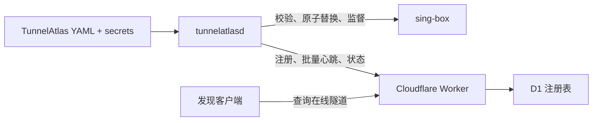

# 架构

TunnelAtlas 采用“本地自治、云端注册发现”的模型：

Worker 不管理本机进程、不下发配置，也不转发隧道业务流量。Agent 从 TunnelAtlas YAML 协议声明和本地 secrets 渲染配置，调用 sing-box 自身校验后原子写入托管配置，再监督 `sing-box run -c <managed-config>`。

## 本机收敛流程

1. 读取协议声明，补齐持久化凭据和证书并渲染 JSON。
2. 写入与托管文件同目录的 `candidate.json`，权限为 `0600`。
3. 执行 `sing-box check -c candidate.json`。
4. 校验成功后通过 rename 原子替换托管配置；管理命令随后重启 Agent 服务。
5. 校验失败时删除候选文件，保持旧配置和当前进程。
6. 每两秒检查子进程；异常退出后按配置的退避时间重启。

## 数据模型

- Node：唯一管理实体；创建后先处于待接入状态，Agent 认领后保存设备公钥、标签、最后序列号和最后活跃时间。
- EnrollmentToken：绑定 Node、10 分钟有效、仅使用一次；重新生成时废止该节点的旧码。
- Tunnel：隶属于 Node 的 inbound 端点、协议、状态、元数据和加密认证参数。

Agent 直接从当前已应用的声明状态构造上报，不反向解析生成的 sing-box JSON。上报只包含建立客户端连接所需的认证字段和公开参数；Reality 私钥、TLS 私钥路径和完整配置不会离开节点。Worker 使用 AES-256-GCM 加密认证对象后写入 D1，每次报告携带完整 inbound 集合，具有快照语义。

## 在线判定

Worker 不运行后台清理任务。查询时使用 `nodes.last_seen_at` 与 `AGENT_OFFLINE_SECONDS` 动态过滤，默认 180 秒。离线记录保留在 D1，便于后续诊断和恢复。

## 当前边界

当前运行状态来自受监督子进程是否存活，尚未接入 sing-box Clash API 或 1.14+ gRPC API，因此不能提供连接数、流量和 outbound URLTest 等深层健康信息。
