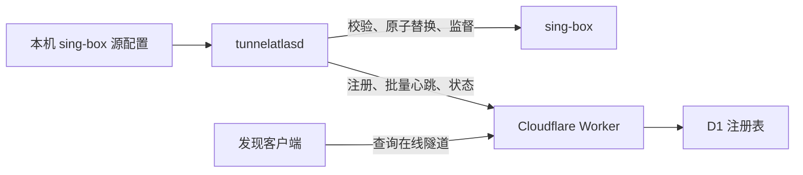

# 架构

TunnelAtlas 采用“本地自治、云端注册发现”的模型：

Worker 不管理本机进程、不下发配置，也不转发隧道业务流量。Agent 读取本地 sing-box JSON 源配置，调用 sing-box 自身校验后写入独立的托管配置，再监督 `sing-box run -c <managed-config>`。

## 本机收敛流程

1. 读取源配置并解析为 JSON，生成稳定格式。
2. 写入与托管文件同目录的 `candidate.json`，权限为 `0600`。
3. 执行 `sing-box check -c candidate.json`。
4. 校验成功后通过 rename 原子替换托管配置，并重启进程。
5. 校验失败时删除候选文件，保持旧配置和当前进程。
6. 每两秒检查子进程；异常退出后按配置的退避时间重启。

## 数据模型

- Site：Agent 的逻辑分组。
- EnrollmentToken：绑定 Site、10 分钟有效、仅使用一次。
- Agent：设备公钥、标签、最后序列号和最后活跃时间。
- Tunnel：隶属于 Agent 的隧道端点、协议、类型、状态和元数据。

Agent 从 sing-box 的 `inbounds`、`outbounds` 和 `endpoints` 提取 tag、type 和网络端点。用户、密码、UUID、私钥及完整配置不会上报。每次报告携带完整集合，具有快照语义。

## 在线判定

Worker 不运行后台清理任务。查询时使用 `agents.last_seen_at` 与 `AGENT_OFFLINE_SECONDS` 动态过滤，默认 180 秒。离线记录保留在 D1，便于后续诊断和恢复。

## 当前边界

当前运行状态来自受监督子进程是否存活，尚未接入 sing-box Clash API 或 1.14+ gRPC API，因此不能提供连接数、流量和 outbound URLTest 等深层健康信息。
