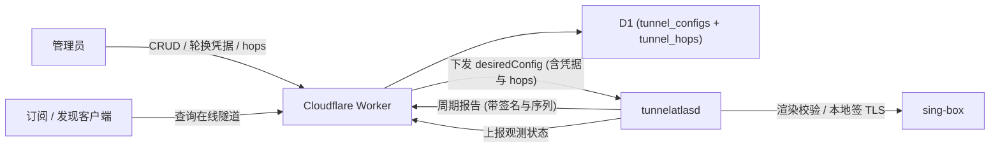

# 架构

TunnelAtlas 采用“Worker 托管期望配置与协议身份、Agent 本地签发 TLS 证书并收敛执行”的模型：

```mermaid
flowchart LR
  ADM["管理员"] -->|"CRUD / 轮换凭据 / hops"| WK["Cloudflare Worker"]
  WK --> D1["D1 (tunnel_configs + tunnel_hops)"]
  AG["tunnelatlasd"] -->|"周期报告 (带签名与序列)"| WK
  WK -->|"下发 desiredConfig (含凭据与 hops)"| AG
  AG -->|"渲染校验 / 本地签 TLS"| ENG["sing-box"]
  AG -->|"上报观测状态"| WK
  CL["订阅 / 发现客户端"] -->|"查询在线隧道"| WK
```

Worker 负责节点注册、期望隧道、协议身份生成、hop 解析、配置版本递增和发现订阅 API。
Agent 负责节点接入、应用下发凭据、为 HY2/TUIC 签发证书、原子收敛并监督 `sing-box`，定期上报观测状态。

## 本机收敛流程

1. **锁与快照**：获取 `control.lock` 独占锁，快照备份托管 JSON、`secrets.json`、证书目录、YAML 配置以及运行时状态。
2. **期望校验**：校验 Worker 下发的期望配置（隧道数量 <= 64，名称、端口、监听地址合法且唯一，协议选项与凭据字段符合规范）。若校验失败，记录 `invalid_desired_config`。
3. **空配置处理**：若期望隧道列表为空，停止正在运行的 sing-box，将权威版本更新至 `runtime.json`，保留最后一份托管 JSON 供诊断，并完成收敛。
4. **凭据与证书对齐**：优先使用下发的 `credentials` 写入 `secrets.json`；缺失时回落到按 `credentialGeneration` 的本地生成。Hysteria2/TUIC 仍按 ID 与代数签发自签名证书。
5. **渲染与校验**：渲染完整的 sing-box JSON（含 hop outbound 与 route）。hops 未就绪时该 inbound 指向 `block`。写入候选文件执行 `sing-box check` 与 `sing-box format`。若失败，记录 `sing_box_validation_failed`。
6. **热切换与启动探查**：将校验通过的文件原子替换至托管路径，启动或重启 sing-box 子进程并等待 500 ms 探查其存活状态。若退出，记录 `sing_box_start_failed`。
7. **持久化与清理**：校验和启动均成功后，提交更新后的 `secrets.json`，清理废弃证书，将新版本与成功状态存入 `runtime.json`。
8. **旧配置裁撤**：若本地 YAML 中包含旧版 `protocols` 或 `publicHost`，首次收敛成功后将其清除并重写 YAML，记录日志通知管理员配置已由 Worker 接管。
9. **失败恢复**：任何步骤失败均无损恢复全套快照，重启先前工作的配置。

## 数据模型

- **Node**：物理节点实体，记录设备公钥、配置版本号 `config_version`、Agent 已确认版本号 `applied_config_version`、申请错误码 `config_apply_error`、最后序列号与活跃时间。
- **TunnelConfig**：Worker 托管的期望隧道，主键 `(node_id, id)`，包含协议选项、`credential_generation`、加密的 `credentials_ciphertext` 与 `subscription_enabled`。
- **TunnelHop**：入口隧道的有序下一跳，引用其他节点的 `tunnel_configs`。同节点、自引用与环禁止。
- **Tunnel**：Agent 上报的实际观测状态，包含端点、协议、运行状态、公开元数据及加密的客户端认证参数。
- **TunnelCloudflareFrontend**：为 VMess-WS 隧道提供的 Cloudflare CDN 前端。

## 在线判定与订阅控制

- 查询在线隧道使用 `nodes.last_seen_at` 与 `AGENT_OFFLINE_SECONDS` 动态过滤，默认 180 秒。
- 订阅 API 仅输出在线节点上状态为 `healthy`、认证完整的隧道。
- 对于已完成版本收敛的节点，订阅可见性直接由 `tunnel_configs.subscription_enabled` 控制。
